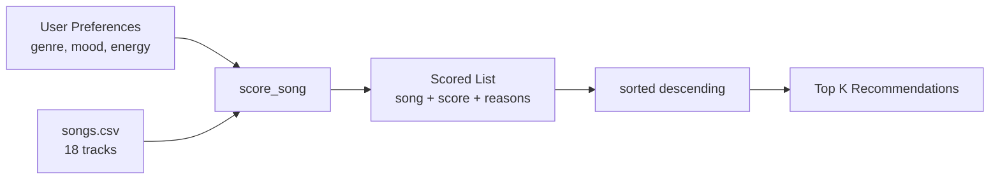

# Music Recommender Simulation

## Project Summary

This project simulates a content-based music recommendation system. Given a user's taste profile — their preferred genre, mood, and energy level — the system scores every song in the catalog and returns the top matches with a short explanation for each pick.

It is a simplified version of what real platforms like Spotify use under the hood. Instead of machine learning, it uses a weighted scoring formula that is fully transparent and explainable.

---

## How The System Works

Real-world recommenders like Spotify combine two main techniques: **collaborative filtering** (finding users similar to you and recommending what they liked) and **content-based filtering** (matching songs to your taste based on their audio features). This simulation focuses on content-based filtering.

Each `Song` in the catalog has the following features:
- `genre` — e.g., pop, lofi, edm, hiphop, rock
- `mood` — e.g., happy, chill, energetic, confident, intense
- `energy` — a 0.0–1.0 float representing how high-energy the track feels
- `tempo_bpm` — beats per minute
- `valence` — musical positivity (0.0 = dark, 1.0 = upbeat)
- `danceability` — how suitable the track is for dancing
- `acousticness` — how acoustic vs. electronic the track is

Each `UserProfile` stores:
- `favorite_genre` — the genre they most want to hear
- `favorite_mood` — their target emotional vibe
- `target_energy` — the energy level they're looking for (0.0–1.0)
- `likes_acoustic` — boolean preference for acoustic sounds

### Algorithm Recipe

For each song, the recommender computes a score using this formula:

| Feature | Match Condition | Points |
|---|---|---|
| Genre | Song genre == user's favorite genre | **+2.0** |
| Mood | Song mood == user's target mood | **+1.0** |
| Energy | `1.0 - abs(song.energy - target_energy)` | **0.0 – 1.0** |

Maximum possible score: **4.0**

The energy score rewards closeness rather than just "higher is better" — a user who wants low-energy chill music gets rewarded for finding low-energy songs, not penalized.

All songs are then ranked highest-to-lowest and the top `k` results are returned with a plain-language reason string (e.g., `"genre match (+2.0), energy similarity (+0.97)"`).

### Data Flow



---

## Getting Started

### Setup

1. Create a virtual environment (optional but recommended):

   ```bash
   python -m venv .venv
   source .venv/bin/activate      # Mac / Linux
   .venv\Scripts\activate         # Windows
   ```

2. Install dependencies:

   ```bash
   pip install -r requirements.txt
   ```

3. Run the app:

   ```bash
   python -m src.main
   ```

### Running Tests

```bash
pytest
```

---

## Experiments You Tried

### Experiment 1 — Conflicted Vibes (adversarial profile)

Profile: `genre=edm, mood=chill, energy=0.88`

The system still recommended high-energy EDM tracks despite the `chill` mood preference. This happens because genre carries +2.0 weight and there are no chill EDM songs in the catalog. The genre weight dominates even when mood conflicts. This reveals a clear filter bubble: users who want a chill EDM vibe get pushed toward energetic EDM regardless.

### Experiment 2 — Weight shift

Original: genre +2.0, mood +1.0, energy 0–1.0

Tested halving genre weight to +1.0 and doubling energy to 0–2.0. The Chill Lofi profile stayed mostly the same (since lofi songs also happen to be low-energy). But the EDM Hype profile changed — Storm Runner (rock, intense, 0.91 energy) started ranking higher because the energy proximity score outweighed the genre mismatch. This made results feel less accurate, confirming genre is the right dominant weight.

---

## Limitations and Risks

- The catalog only has 18 songs — results are heavily constrained by dataset size
- Genre matching is exact string equality — `"indie pop"` and `"pop"` never match
- No tempo, valence, or danceability features are used in scoring despite being in the data
- The system cannot handle users with mixed tastes (e.g., someone who likes both classical and metal)
- There is no diversity enforcement — top results can all be by the same artist

---

## Reflection

See [model_card.md](model_card.md) for the full model card and personal reflection.

One thing that surprised me: even a 3-rule scoring function produces recommendations that *feel* personalized. The "Chill Lofi" profile correctly surfaces Rain Tape Vol 2 as a perfect 4.0 score, and that song genuinely does fit that vibe. The algorithm isn't intelligent — it's just math — but the output reads like it made a judgment call.

The bigger realization was about bias. The Conflicted Vibes edge case showed how genre weight creates a filter bubble even when the user explicitly asked for something different. Real recommenders face this at scale, and it is much harder to detect because you never see the songs that didn't make the list.
